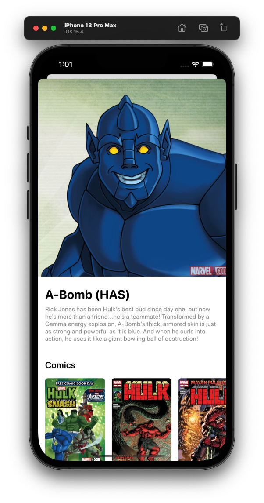

<p align="center">
  
</p>
<h3 align="center">A little app to explore Marvel characters on your iPhone.</h3>

## About

The purpose of this project is to develop a non-trivial app using MVP+C, and including a bunch of unit tests.

The app leverages the [Marvel API](https://developer.marvel.com/) to display descriptions and images of the 1000+ characters in the Marvel universe.

This project has been built using UIKit and no third party dependencies.

## Features

- **Characters list**: displays a paginated list of characters and their thumbnails.
- **Character detail**: displays a picture of a character, its full description, and the comics it appears in.

<p align="center">
  
  
</p>

## Technical details

### Architecture

This app has been developed using an MVP+C architectural pattern, which is a combination of the Model-View-PresentationModel architecture, plus the Coordinator pattern. In this implementation, the binding between the Views and the PresentationModels is done via delegation. The app has three major layers:
- The **Presentation** layer, which contains the views and other UIKit-related units.
- The **Domain** layer, which contains the entities and use cases.
- The **Data** layer, which contains the networking and local data handling, as well as the models and authentication logic needed to connect to the Marvel API.

It also has an App layer - that takes care of wiring up app-level dependencies and managing app lifecycle and navigations. Every layer has its corresponding folder in the project file structure. There is an additional folder - Common - that contains general-purpose extensions and protocols.

### Configuration and schemes

The app has two configurations: Debug and Release. Each configuration maps to an Xcode project scheme. The main difference between these configurations is in the way they wire up the data layer:
- **In the Debug configuration** the Marvel character data is retrieved from local, static JSONs. No network calls needed, no networking dependencies involved.
- **In the Release configuration** the app needs to connect to the Marvel API to retrieve character data. This configuration relies on real network calls for the app to work.

### Tests

This app has a bunch of unit tests, but the coverage is not 100%. Only the domain layer has been tested more thoroughly, and the view models have been developed using TDD. The rest of the units have been tested more sparingly, just when tests were convenient for development.

## Download and run

- **Clone**: First, clone the repository with the 'clone' command.

```
$ git clone git@github.com:drogel/Marvel.git
```

- **Marvel API keys**: Set your Marvel API keys as environment variables. Go to schemes, Marvel, and select Edit Scheme. Then, insert the environment variables into Run option -> Arguments -> Environment Variables.
<p align="center">
  
</p>

## Authors

- **Diego Rogel** - [GitHub](https://github.com/drogel).

## License

This project is in the public domain, you can do whatever you want with it - see the [LICENSE.md](LICENSE.md) file for details.
